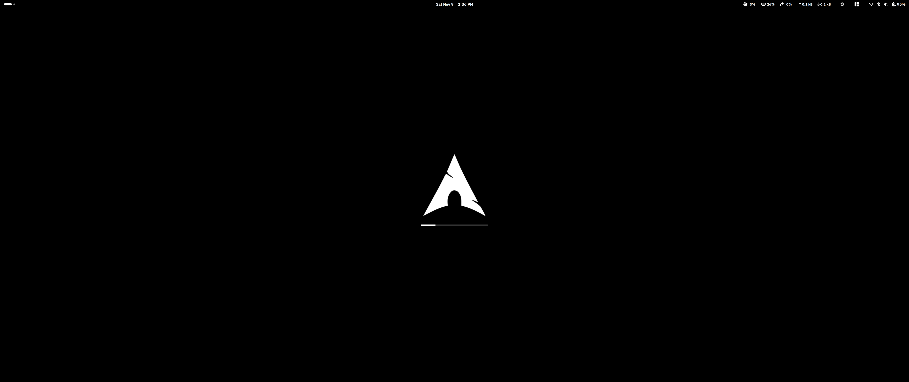

# Custom Arch Linux ISO

This is a customized Arch Linux build based on a minimal GNOME Workstation setup, designed for a streamlined and efficient environment tailored to Software Development needs. Built on the official [archlinux/archiso](https://github.com/archlinux/archiso), this live USB provides:

- A minimal GNOME desktop with essential networking, Wi-Fi, and core GNOME apps.
- A macOS-inspired boot screen via Plymouth for a clean and modern startup experience.
- Optional proprietary AMD and NVIDIA driver support (including nvidia-open-dkms).

Whether you’re setting up a portable development environment or a clean Arch install, this ISO offers a lightweight, software-dev-ready GNOME environment with room for further customization.




### Additional packages and tweaks include:
- Brave Browser
- VS Code
- GitHub Desktop
- C++ Development Environment (GCC and Clang)
- Proprietary Nvidia Drivers 
- Fastfetch (C++ Neofetch replacement)
- Plymouth Theme [archlive/airootfs/usr/share/plymouth/themes/logo-mac-style](archlive/airootfs/usr/share/plymouth/themes/logo-mac-style)
- Font IBM Plex Sans [archlive/airootfs/usr/share/fonts/ttf/ibm-plex-sans](archlive/airootfs/usr/share/fonts/ttf/ibm-plex-sans)
- Font Intel One Mono [archlive/airootfs/usr/share/fonts/ttf/intel-one-mono](archlive/airootfs/usr/share/fonts/ttf/intel-one-mono)
- A universal solution to fix blurry Electron apps when using fractional scaling on Wayland with HiDPI monitors [archlive/airootfs/etc/environment](archlive/airootfs/etc/environment)
- Multilib repository is on [archlive/pacman.conf](archlive/pacman.conf)

Full package list can be found in [archlive/packages.x86_64](archlive/packages.x86_64)


## How to Use:
First you need to:

```
sudo pacman -S archiso
```


### Clone the Repository:

```
git clone https://github.com/darkestmedium/archiso.git && cd ./archiso
```


### For Visual Studio Code Users:
You can build the ISO using the Visual Studio Code tasks by pressing **Ctrl + Shift + B**, selecting **"Build ISO"**, and waiting for it to finish. Afterward, you can burn/copy it to a USB drive with the **"Burn to USB Drive"**. Alternatively you can use the **Build and Burn** task to do everything in one go.
Available build tasks:
- Build ISO
- Burn to USB Drive
- Build and Burn
- Clean Workspace


### Without Visual Studio Code:
You can manually run the following shell commands: **(Replace $inputFields with actual names.)**

```
sudo mkarchiso \
	-L ${input:isoLabel} \
	-w	./build" \
	-o	./iso" \
	-v \
	${input:config}
```


### Burn the ISO to a USB :

```
sudo dd \
  if=${input:inputFile} \
  of=${input:outputFile} \
  bs=4M status=progress
```
